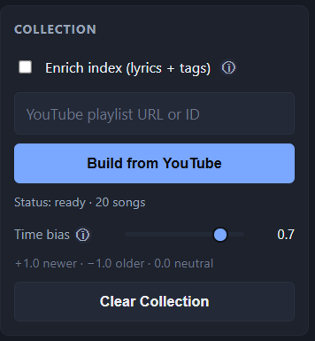
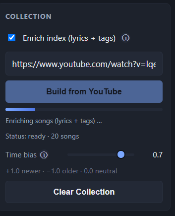
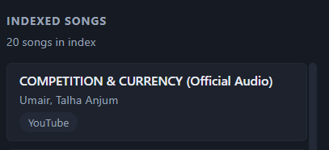
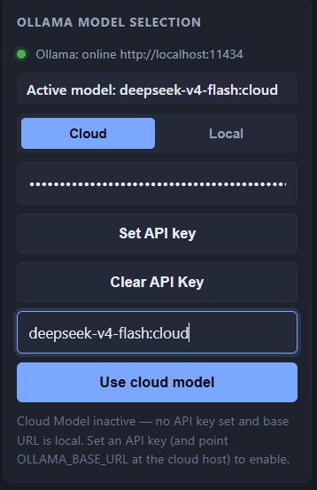
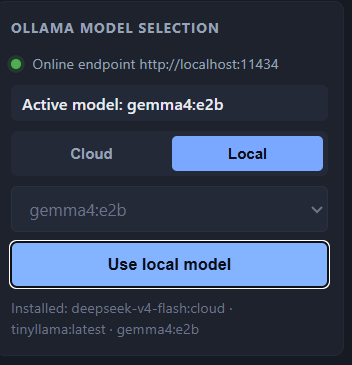

# AI Music Conversational Assistant

An offline-first conversational AI for a personal music collection. Ingest a
YouTube playlist or a Markdown file of songs, then chat with a local LLM
(via Ollama) over the collection using RAG. The assistant returns song
recommendations, metadata, short legally-permitted lyric excerpts, and
previews, with six interaction modes: Lyrical conversational (default),
Lyric Prose Recommendation, Explain, Antakshari, Generation, and List.


## Setup

1. Install dependencies:
   ```bash
   pip install -r requirements.txt
   ```
2. (Optional) copy `.env.example` to `.env` and adjust the Ollama
   URL/model, lyrics provider, and enrichment mode.
3. Ensure Ollama is running and the configured model is pulled:
   ```bash
   ollama serve                       # in a separate terminal
   ollama pull <model>                # the model named in config.yaml
   ```
   The model identifier is configurable via `config.yaml`
   (`ollama.model`) or the `OLLAMA_MODEL` env var — it is intentionally
   not hard-coded. Check `config.yaml` for the active default rather
   than assuming a specific model name.

## Run

```bash
python -m flask --app ui/flask_app.py run --port 8501
```

Open the UI, paste a YouTube playlist URL (or paste/edit a Markdown
playlist) and build the index, then chat. Sources are rendered under
each reply; each cited song shows its provider, an HTML5 preview player
(when a `preview_url` is available), and a "Lyrics" button.

## Configuration

See `config.yaml`. Key sections:

- `ollama` — `base_url`, `model`, `temperature`, `api_key` (env:
  `OLLAMA_BASE_URL`, `OLLAMA_MODEL`, `OLLAMA_API_KEY`).
- `embedding` — Sentence Transformers model (env: `EMBEDDING_MODEL`).
- `rag` — `top_k`, `rerank_k`, FAISS/SQLite paths.
- `ranking` — semantic / keyword / feedback / time / context /
  repetition_penalty weights (experimentally tunable).
- `personalization` — `default_time_bias`, `diversity_weight`,
  `feedback_weights` (plays / likes / completion / skips).
- `response` — `max_lyric_excerpt_words` (default 25), `include_source`.
- `lyrics` — `provider` (`lrclib` | `musixmatch` | `none`), LRCLIB URL /
  user-agent, Musixmatch user token (env: `LYRICS_PROVIDER`,
  `MUSIXMATCH_USER_TOKEN`).
- `enrichment` — `mode` (`auto` | `lyrics` | `tags` | `both` | `none`),
  `lyrics_index_words`, `llm_tags` (env: `ENRICHMENT_MODE`).
- `modes` — `explain_temperature`, `generation_temperature`,
  `antakshari_rule`, `generation_top_k`, `generation_diversity`.

> **Secrets:** do not commit API keys to `config.yaml`. Use the env
> overlays (`.env` + `python-dotenv`, already wired in `app/config.py`).

## Layout

```
app/
  config.py            # YAML + env config loader
  main.py              # MusicAssistant orchestration, chat_dispatch
  llm/                 # Gemma (Ollama OpenAI-compatible client), ollama.py (server/pull helpers)
  rag/                 # embeddings, vector_store (FAISS+SQLite), retriever, reranker
  ingestion/            # markdown, youtube, enrichment (lyric + tag)
  lyrics/              # LyricsProvider Protocol: LRCLIB (default), Musixmatch (stub)
  mcp/                 # in-process MCP tool registry: feedback, rag, lyrics servers
  modes/               # intent router + explain / antakshari / generation / list
  personalization/     # feedback store, ranking, recency
  safety/              # response validator (excerpt cap, full-lyrics detection)
ui/
  flask_app.py         # routes + SSE
  templates/index.html
  static/{style.css,app.js}
data/                  # faiss.index, songs.db, embeddings/
```

## Interaction modes

- **Lyrical conversational** (default) — lyric-first chat: the response
  is a capped lyric excerpt from the best-matching song, with full
  provenance. The LLM is used only for query understanding; it never
  generates lyric text.
- **Lyric Prose Recommendation** — single-letter (A–Z) input → multiple
  short lyric excerpts as Antakshari-style examples.
- **Antakshari** — first/last-letter chain game against the collection
  (in-memory session, no LLM needed for the core loop).

Intent is auto-routed by the LLM with a keyword-rule fallback; the UI
radio can force a mode.


<p align="center">
  
</p>

## Step 1: Collection

- **Build a Collection:** Add the YouTube playlist link and click **Build from YouTube** to create a collection of songs.

- **Enrich Index:** Adds more detailed metadata and tags to the songs. Enabling this option provides richer song information but **takes longer to process**.

- **Time Bias:** Controls the preference for newer or older songs:
  - Values between **0.1 and 1.0** → prefer **newer songs**.
  - Lower values → give relatively more preference to **older songs**.

<p align="center">
  
  
</p>

<p align="center">
  
</p>


## Step 2: Ollama Model Selection

The system supports two types of Ollama models: **Cloud (Online)** and **Local (Offline)**.

- **Cloud (Online) Model:** Enter the API key from your Ollama account and click **Set API Key**. Then select the desired cloud model and click **Use cloud model**.

- **Local (Offline) Model:** Download a local model through Ollama. The appropriate model depends on your **PC's hardware configuration**. After downloading the model, click **Use local model**.

<p align="center">
  
  
</p>


## Step 3: Chat Mode

The system provides two chat modes for interacting with the AI:

- **Lyrical Conversational:** Enter a prompt and the AI responds with a sequence of sentences formed from song lyrics. The lyrics are generated from the **Collection created in Step 1**.

- **Lyric Prose Recommendation (Antakshari):** Enter a letter, and the AI recommends a sequence of song lyrics beginning with that letter. The responses can include lyrics from **any part of a song**, including lines from the middle of the song.
